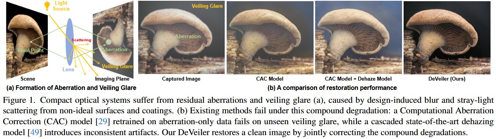
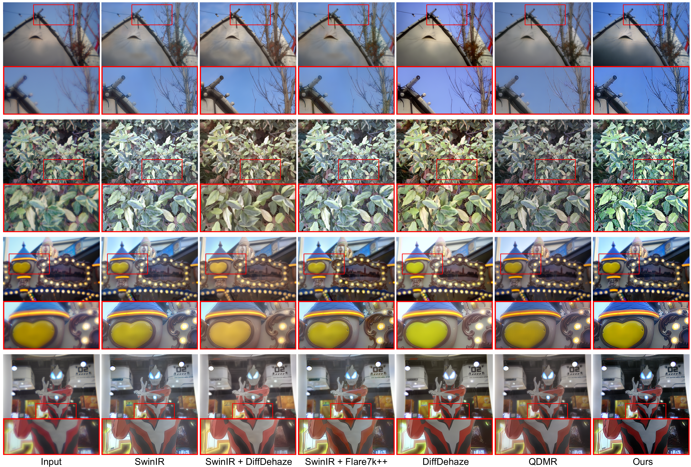
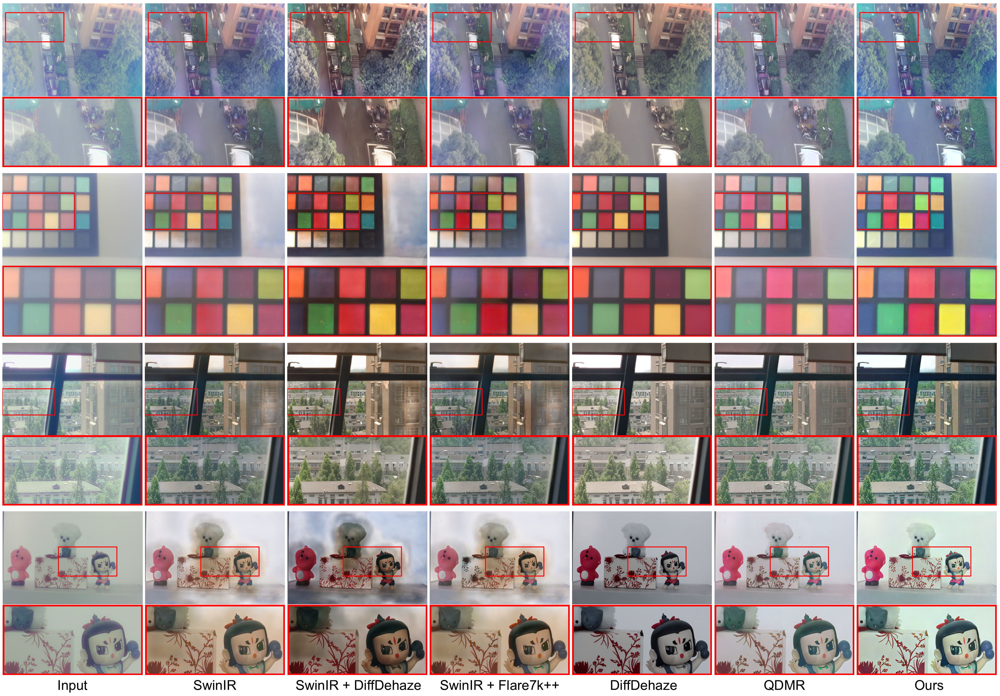

# [CVPR 2026] Learning Latent Transmission and Glare Maps for Lens Veiling Glare Removal

[](https://arxiv.org/abs/2511.17353v1)
[](https://xiaolongqian.github.io/DeVeiler-page/)
[](https://huggingface.co/datasets/Residual/VeilingGlareData)
[](LICENSE)
[](#code--models)

This repository presents the implementation of the paper:

> **Learning Latent Transmission and Glare Maps for Lens Veiling Glare Removal**<br>
> [Xiaolong Qian](https://github.com/XiaolongQian/)\*<sup>1</sup>, [Qi Jiang](https://github.com/zju-jiangqi/)\*<sup>1</sup>, [Lei Sun](https://ahupujr.github.io/)<sup>2,#</sup>, [Zongxi Yu](https://github.com/ZongxiYu-ZJU/)<sup>1</sup>, [Kailun Yang](https://yangkailun.com/)<sup>3</sup>, [Peixuan Wu](https://xiaolongqian.github.io/DeVeiler-page/)<sup>1</sup>, [Jiacheng Zhou](https://xiaolongqian.github.io/DeVeiler-page/)<sup>1</sup>, [Yao Gao](https://github.com/LiGpy/)<sup>1</sup>, [Yaoguang Ma](https://scholar.google.com/citations?user=UnVrCQ0AAAAJ&hl=zh-CN)<sup>1</sup>, [Ming-Hsuan Yang](https://faculty.ucmerced.edu/mhyang/)<sup>4</sup>, [Kaiwei Wang](http://wangkaiwei.org/)<sup>1,#</sup><br>
> The IEEE / CVF Computer Vision and Pattern Recognition Conference (CVPR), 2026

**Affiliations**
- <sup>1</sup>Zhejiang University
- <sup>2</sup>INSAIT, Sofia University St. Kliment Ohridski
- <sup>3</sup>Hunan University
- <sup>4</sup>University of California, Merced

**Notes:** \* Equal contribution &nbsp;&nbsp; # Corresponding author



## Key Highlights

- **Physically-Informed Data Generation:** VeilGen synthesizes paired training data using latent transmission and glare maps for aberration and veiling glare modeling.
- **Reversible Restoration Network:** DeVeiler uses a physically-consistent, reversible network with degradation-consistency constraints to restore image structures and color.
- **Generalization Across Minimalist Optics:** Works on single-lens and metasurface-refractive hybrid systems, effectively removing glare while preserving details.
- **Domain Adaptation Potential:** The combination of physically-informed data and reversible restoration allows adaptation to diverse imaging conditions and visual tasks.

## Results

- **Real-world compound domain (single-lens)**
  

- **Real-world compound domain (metasurface-refractive hybrid lens)**
  

## News

- **2026-02**: DeVeiler is accepted to **CVPR 2026**.
- **2026-04**: DeVeiler is selected as a **CVPR 2026 Highlight**.
- **2026-05**: The dataset and code for **VeilGen** and **DeVeiler** is released.

## Code & Models

This repository contains the official implementation of our data synthesis and image restoration pipelines.

| Module | Purpose | Documentation |
|---|---|---|
| [`VeilGen`](VeilGen/) | Latent-map-guided data synthesis and generation. | [`VeilGen/README.md`](VeilGen/README.md) |
| [`DeVeiler`](Deveiler/) | Three-stage DeVeiler image restoration training pipeline. | [`Deveiler/README.md`](Deveiler/README.md) |

Pretrained model checkpoints will be updated here when available.

## Quick Start

For data synthesis, start from the VeilGen module:

```bash
cd VeilGen
conda create -n veilgen python=3.10 -y
conda activate veilgen
pip install -r requirements.txt
```

Then follow [`VeilGen/README.md`](VeilGen/README.md) to configure paths, train VeilGen, predict latent maps, and run inference.

For image restoration training, start from the DeVeiler module:

```bash
cd Deveiler
conda create -n deveiler python=3.9 -y
conda activate deveiler
pip install -r requirements.txt
pip install -e .
```

Then follow [`Deveiler/README.md`](Deveiler/README.md) to run the three-stage training pipeline:

1. Stage 1: DeVeiler pretraining.
2. Stage 2: DDN training.
3. Stage 3: DeVeiler finetuning.

## Data

The dataset is available on Hugging Face: [Residual/VeilingGlareData](https://huggingface.co/datasets/Residual/VeilingGlareData).

## Acknowledgements

This project benefits from the excellent open-source codebases of [DiffBIR](https://github.com/XPixelGroup/DiffBIR), [Learning-Hazing-to-Dehazing](https://github.com/ruiyi-w/Learning-Hazing-to-Dehazing), [BasicSR](https://github.com/XPixelGroup/BasicSR), and [FeMaSR](https://github.com/chaofengc/FeMaSR). We sincerely thank the authors for their contributions to the community.

## License

This work is licensed under the Apache License, Version 2.0, as defined in the [LICENSE](LICENSE) file.

By downloading and using the code and models, you agree to the terms in the [LICENSE](LICENSE).

## Citation

If you find our work useful, please consider citing:

```bibtex
@article{qian2025learning,
  title={Learning Latent Transmission and Glare Maps for Lens Veiling Glare Removal},
  author={Qian, Xiaolong and Jiang, Qi and Sun, Lei and Yu, Zongxi and Yang, Kailun and Wu, Peixuan and Zhou, Jiacheng and Gao, Yao and Ma, Yaoguang and Yang, Ming-Hsuan and Wang, Kaiwei},
  journal={arXiv preprint arXiv:2511.17353},
  year={2025}
}
```
